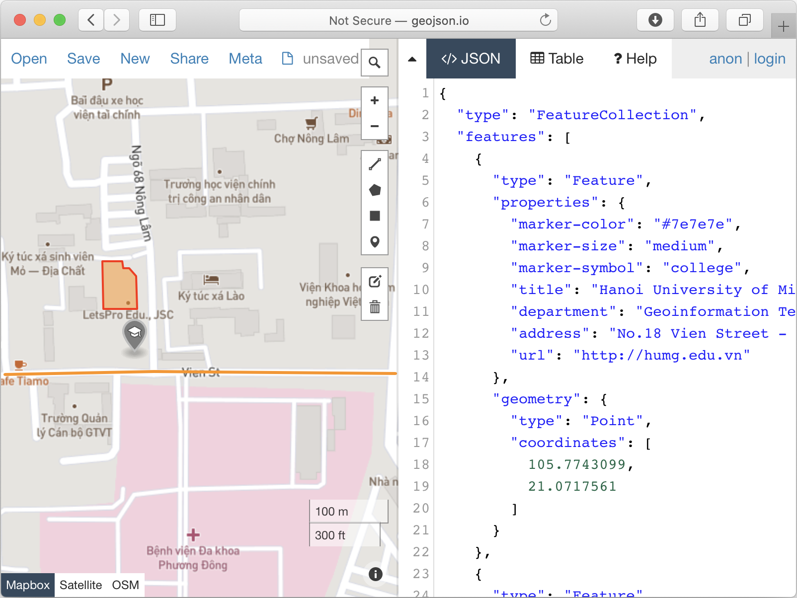

# GeoJSON package for Dart and Flutter developers
[](https://pub.dartlang.org/packages/geojson_vi)

GeoJSON package for Dart and Flutter developers to create, read, search, update and delete the geospatial data interchange format (GIS data). This package was originally published by Chuyen, T. T. (2020). The GeoJSON package for Dart and Flutter developers. Zenodo. https://doi.org/10.5281/ZENODO.3841927.

This package supports GeoJSON objects including:

- [x] **Geometry**
  - [x] **Point** - represents a single position, the `coordinates` member is a single position in the order of longitude, latitude
  - [x] **MultiPoint** - represents an array of positions
  - [x] **LineString** - represents an array of positions
  - [x] **MultiLineString** - represents an array of LineString
   coordinate arrays
  - [x] **Polygon** - represents an array of linear ring
  - [x] **MultiPolygon** - represents an array of Polygon coordinate
   arrays
  - [x] **GeometryCollection** - represents a list of the geometry.
- [x] **Feature** - represents a spatially bounded entity that includes properties member
- [x] **FeatureCollection** - represents a list of the feature.

## GeoJSON UML Model


## Usage

### Create GeoJSON object

```dart
  final map = {
    'type': 'Point',
    'coordinates': [105.77389, 21.0720414]
  };

  final jsonString =
      '{"type": "Point", "coordinates": [105.78070163726807, 21.067921688241626]}';

  final polygonCoordinates = [
    [
      [104.765625, 20.468189],
      [106.545410, 20.468189],
      [106.545410, 21.596150],
      [104.765625, 21.596150],
      [104.765625, 20.468189]
    ]
  ];

  // Creating a GeoJSON object from data without knowing its type
  final pointFromMap = GeoJSON.fromMap(map);

  // Creating GeoJSONPoint object from JSON string already know its type
  final pointFromJSON = GeoJSONPoint.fromJSON(jsonString);

  // Creating GeoJSONGeometry object from data without knowing its type
  final geometryFromMap = GeoJSONGeometry.fromMap(map);

  // Creating GeoJSONPoint object from JSON string already know its type
  final geometryFromJSON = GeoJSONPoint.fromJSON(jsonString);

  // Creating GeoJSONPoint object from coordinates data
  final pointFromCoordinates = GeoJSONPoint([105.77389, 21.0720414]);

  // Creating a GeoJSONFeature object
  final feature = GeoJSONFeature(
    GeoJSONPoint([105.780701, 21.067921]),
    properties: {
      'title': 'Hanoi University of Mining and Geology',
      'url': 'http://humg.edu.vn',
    },
  );

  // Creating GeoJSONFeatureCollection object
  final featureCollection = GeoJSONFeatureCollection([]);
  featureCollection.features.add(feature);

  // Creating more GeoJSONFeature
  final polygon = GeoJSONPolygon(polygonCoordinates);
  final polygonFeature = GeoJSONFeature(polygon);
  featureCollection.features.add(polygonFeature);
```

### Read and Write the GeoJSON file

```dart
  final path = '../test/test_resources/data.geojson';
  final newPath = '../test/test_resources/data_new.geojson';
  final geoJSONFromFile = await GeoJSON.load(path);
  await geoJSONFromFile.save(newPath);
```

### Demo

```dart
import 'package:geojson_vi/geojson_vi.dart';

void main() {
  final featureCollection = GeoJSONFeatureCollection([]);
  final point = GeoJSONPoint([105.7743099, 21.0717561]);
  final feature = GeoJSONFeature(point, properties: {
    'marker-color': '#7e7e7e',
    'marker-size': 'medium',
    'marker-symbol': 'college',
    'title': 'Hanoi University of Mining and Geology',
    'department': 'Geoinformation Technology',
    'address':
        'No.18 Vien Street - Duc Thang Ward - Bac Tu Liem District - Ha Noi, Vietnam',
    'url': 'http://humg.edu.vn'
  });
  featureCollection.features.add(feature);
  final pos1 = [105.7771289, 21.0715458];
  final pos2 = [105.7745218, 21.0715658];
  final pos3 = [105.7729125, 21.0715358];
  final lineString = GeoJSONLineString([pos1, pos2, pos3]);
  featureCollection.features.add(GeoJSONFeature(lineString, properties: {
    'stroke': '#7e7e7e',
    'stroke-width': 2,
    'stroke-opacity': 1,
    'title': 'Vien St.'
  }));
  final p01 = [105.7739666, 21.0726795]; // The first position
  final p02 = [105.7739719, 21.0721991];
  final p03 = [105.7743394, 21.0721966];
  final p04 = [105.7743310, 21.0725269];
  final p05 = [105.7742564, 21.0726120];
  final p06 = [105.7741865, 21.0726095];
  final p07 = [105.7741785, 21.0726746];
  final p08 = [105.7739666, 21.0726795]; // The last position
  final linerRing = [p01, p02, p03, p04, p05, p06, p07, p08];
  featureCollection.features.add(
    GeoJSONFeature(
      GeoJSONPolygon([linerRing]),
      properties: {
        'stroke': '#555555',
        'stroke-width': 2,
        'stroke-opacity': 1,
        'fill': '#ab7942',
        'fill-opacity': 0.5,
        'title': "HUMG's Office"
      },
    ),
  );
  print(featureCollection.toJSON());
}
```
Output: ```new.geojson```
```JavaScript
{
  "type": "FeatureCollection",
  "features": [
    {
      "type": "Feature",
      "properties": {
        "marker-color": "#7e7e7e",
        "marker-size": "medium",
        "marker-symbol": "college",
        "title": "Hanoi University of Mining and Geology",
        "department": "Geoinformation Technology",
        "address": "No.18 Vien Street - Duc Thang Ward - Bac Tu Liem District - Ha Noi, Vietnam",
        "url": "http://humg.edu.vn"
      },
      "geometry": {
        "type": "Point",
        "coordinates": [
          105.7743099,
          21.0717561
        ]
      }
    },
    {
      "type": "Feature",
      "properties": {
        "stroke": "#7e7e7e",
        "stroke-width": 2,
        "stroke-opacity": 1,
        "title": "Vien St."
      },
      "geometry": {
        "type": "LineString",
        "coordinates": [
          [
            105.7771289,
            21.0715458
          ],
          [
            105.7745218,
            21.0715658
          ],
          [
            105.7729125,
            21.0715358
          ]
        ]
      }
    },
    {
      "type": "Feature",
      "properties": {
        "stroke": "#555555",
        "stroke-width": 2,
        "stroke-opacity": 1,
        "fill": "#ab7942",
        "fill-opacity": 0.5,
        "title": "HUMG's Office"
      },
      "geometry": {
        "type": "Polygon",
        "coordinates": [
          [
            [
              105.7739666,
              21.0726795
            ],
            [
              105.7739719,
              21.0721991
            ],
            [
              105.7743394,
              21.0721966
            ],
            [
              105.774331,
              21.0725269
            ],
            [
              105.7742564,
              21.072612
            ],
            [
              105.7741865,
              21.0726095
            ],
            [
              105.7741785,
              21.0726746
            ],
            [
              105.7739666,
              21.0726795
            ]
          ]
        ]
      }
    }
  ]
}
```
Quick viewing on geojson.io


## Reference
H. Butler, M. Daly, A. Doyle, S. Gillies, S. Hagen, and T. Schaub, "The GeoJSON Format", August 2016, https://tools.ietf.org/html/rfc7946.


## Features and bugs

Please file feature requests and bugs at the [issue tracker][tracker].

[tracker]: https://github.com/chuyentt/geojson_vi/issues